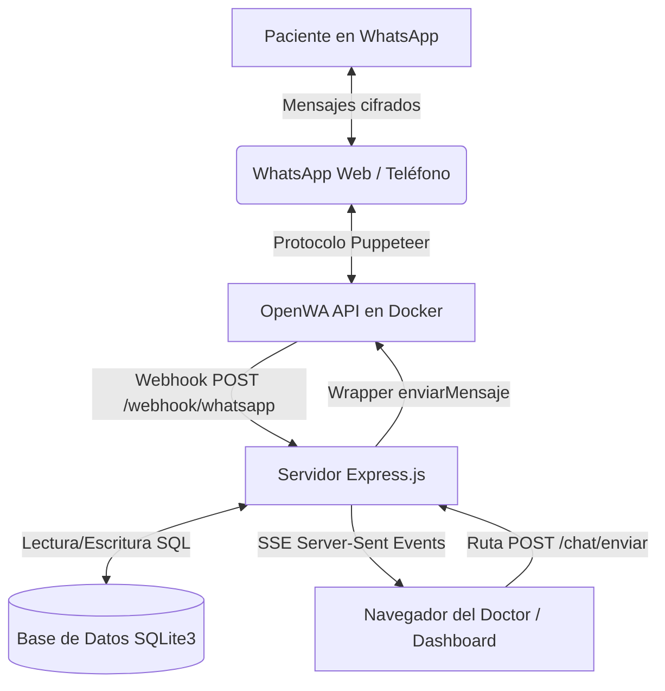

# 🩺 Asistente Inteligente de Control de Citas Médicas vía WhatsApp

Este documento contiene la **Documentación Técnica del Proyecto** y la **Guía de Puesta en Marcha** paso a paso para encender los servicios sin inconvenientes. Está diseñado de forma limpia y profesional para su presentación o entrega.

---

## 📋 1. Ficha Técnica y Tecnologías

El sistema es una solución integral para médicos y consultorios privados que automatiza el ciclo de vida de las citas médicas (agendamiento, confirmación, recordatorios y encuestas) a través de WhatsApp, complementado con un panel de administración premium y chat en tiempo real.

* **Servidor Backend**: Node.js, Express.js.
* **Base de Datos**: SQLite3 (base de datos relacional ultraligera y embebida).
* **Puente de WhatsApp**: OpenWA (servicio API REST y Webhooks que corre sobre un contenedor Docker).
* **Frontend del Panel**: Plantillas EJS estructuradas dinámicamente con Bootstrap 5, variables de CSS estéticas, tipografía *Outfit* de Google Fonts y micro-animaciones CSS.
* **Componentes Visuales**: FullCalendar v6 (Calendario Interactivo), Bootstrap Icons.
* **Actualización en Tiempo Real**: Server-Sent Events (SSE) que transmiten los mensajes entrantes y salientes de WhatsApp directamente al navegador en milisegundos.

---

## 🏗️ 2. Arquitectura del Sistema

El flujo de información se organiza de la siguiente manera:



1. **Recepción**: Cuando el paciente envía un mensaje, el teléfono lo sincroniza con WhatsApp Web. El contenedor de **OpenWA** captura el evento y lo envía mediante una petición HTTP POST al **Webhook** de Node.js en `/webhook/whatsapp`.
2. **Procesamiento y Deduplicación**: El servidor Node.js valida el mensaje:
   - Filtra que no sea grupal o un loop del propio bot (`fromMe`).
   - Deduplica peticiones duplicadas usando una caché en memoria de IDs únicos de mensajes (`processedMessageIds`).
   - Resuelve identificadores locales LID a números JID legibles llamando a la API de OpenWA.
   - Sigue la máquina de estados conversacional guardada en la base de datos para responder de acuerdo al flujo.
3. **Persistencia e Historial**: Todos los mensajes (automáticos del bot, manuales del médico o entrantes del paciente) se almacenan en la tabla `historial_mensajes`.
4. **Sincronización SSE**: Tras registrarse un mensaje, el servidor lo empuja instantáneamente por un canal SSE (`/api/updates/live`) a las ventanas abiertas del navegador, logrando que el Chat en Vivo se actualice de forma reactiva sin recargar la página.

---

## ⚡ 3. Guía de Puesta en Marcha (Encendido Paso a Paso)

Sigue estos pasos en orden para encender el sistema sin problemas en cualquier computadora con Windows:

### Paso 1: Iniciar Docker Desktop
* Abre la aplicación **Docker Desktop** en Windows.
* Espera unos segundos hasta que el icono de estado de Docker en la esquina inferior izquierda cambie a **Verde** (indica que el motor Docker está activo).

### Paso 2: Levantar el contenedor de OpenWA
* Abre una terminal de PowerShell o CMD en la carpeta raíz del proyecto (`wasap/OpenWA`).
* Ejecuta el siguiente comando para iniciar el contenedor de WhatsApp en segundo plano:
  ```bash
  docker-compose up -d
  ```
* *Nota:* Para verificar que está corriendo, puedes abrir [http://localhost:2785/api/docs](http://localhost:2785/api/docs) en tu navegador. Debería abrir la documentación Swagger de OpenWA.

### Paso 3: Iniciar el Servidor de Node.js
* En otra terminal (también dentro de la carpeta `wasap/OpenWA`), ejecuta el comando de inicio del servidor:
  ```bash
  node dashboard.js
  ```
* Verás los siguientes logs de confirmación en la consola:
  ```
  💾 Base de datos inicializada
  🚀 Dashboard unificado iniciado en http://localhost:3001
  📊 Dashboard: http://localhost:3001/dashboard
  🕐 Sistema de recordatorios automáticos iniciado (cada 1h)
  ```

### Paso 4: Sincronizar el Bot con tu Teléfono (Escaneo QR)
* Abre el Panel de Control en tu navegador: [http://localhost:3001/dashboard](http://localhost:3001/dashboard)
* En la barra lateral izquierda verás el widget de **WhatsApp Bot**.
* Si el estado es **Desconectado**, aparecerá un código QR automáticamente en el widget de la barra lateral.
* Abre WhatsApp en tu celular, ve a *Dispositivos Vinculados* > *Vincular un dispositivo*, y escanea el código QR que se muestra en pantalla.
* En 5-10 segundos, el widget de la barra lateral cambiará a **Conectado (Listo)** en color verde. ¡Tu bot ya está operativo!

---

## 🤖 4. Flujos Automatizados del Chatbot

### A. Agendamiento de Nueva Cita
Cuando un paciente escribe palabras clave como `"cita"` o `"agendar"`, el bot inicia el flujo conversacional paso a paso:
1. **Nombre**: Solicita el nombre completo del paciente.
2. **Fecha**: Pide la fecha en formato `DD/MM/YYYY`.
3. **Sugerencia de Horas**: El bot calcula las horas libres de ese día. Le envía al paciente una lista numerada de opciones disponibles (ej: `1️⃣ 09:00`, `2️⃣ 10:00`).
4. **Selección de Hora**: El paciente responde con el número de su opción (ej: `1`).
5. **Motivo**: Solicita el motivo de la consulta.
6. **Confirmación**: Presenta un resumen de la cita. Al responder `"sí"`, la cita se agenda como **Confirmada** en la base de datos y se le despacha de inmediato el mensaje de ubicación.

### B. Confirmación con Ubicación y Indicaciones
Al momento de confirmarse una cita por cualquiera de las vías del bot, el sistema envía automáticamente un mensaje que incluye:
* La dirección física del consultorio.
* El enlace de Google Maps para abrir la navegación GPS.
* Las indicaciones previas del médico (ej: ayuno, identificación, llegar 10 minutos antes).

### C. Recordatorios 24 Horas Antes
* Cada hora, el servidor revisa si hay citas programadas para el día de mañana que no hayan recibido recordatorio.
* Envía un mensaje con las opciones: `1` (Confirmar), `2` (Cancelar) o `3` (Reagendar).
* Si el paciente responde `3` (Reagendar), el bot cancela la cita original y lo introduce directamente en el flujo de selección de nueva fecha y hora sugerida.

### D. Encuesta de Satisfacción Automatizada
* Cada 30 minutos, el scheduler busca citas finalizadas hace más de 2 horas.
* Envía una encuesta de satisfacción solicitando calificar el servicio del 1 al 5.
* La respuesta del paciente se captura y se guarda directamente en la columna `calificacion` de la tabla de la cita para el análisis del médico.

---

## 💾 5. Estructura de la Base de Datos (`chatbot-citas.db`)

El sistema utiliza SQLite3 con 5 tablas interconectadas para garantizar la integridad y velocidad del servicio:

### 1. Tabla `pacientes`
Almacena el directorio de clientes del consultorio.
* `id` (INTEGER PRIMARY KEY AUTOINCREMENT): Identificador único.
* `telefono` (TEXT UNIQUE): Número de teléfono normalizado (formato `521...`).
* `nombre` (TEXT): Nombre completo.
* `creado_en` (DATETIME): Fecha de registro en el sistema.

### 2. Tabla `citas`
Registra el historial y programación de consultas.
* `id` (INTEGER PRIMARY KEY AUTOINCREMENT): Identificador único.
* `paciente_id` (INTEGER, FOREIGN KEY): Paciente asociado.
* `fecha` (TEXT): Fecha de la cita (`YYYY-MM-DD`).
* `hora` (TEXT): Hora de la cita (`HH:MM`).
* `motivo` (TEXT): Razón de la consulta.
* `estado` (TEXT): Estado de la cita (`pendiente`, `confirmada`, `cancelada`, `reagendada`).
* `creada_en` (DATETIME): Fecha de creación del registro.
* `confirmada_en` (DATETIME): Fecha de confirmación.
* `recordatorio_enviado` (INTEGER): Control de envío de recordatorios (0 o 1).
* `encuesta_enviada` (INTEGER): Control de envío de encuesta (0 o 1).
* `calificacion` (INTEGER): Calificación otorgada en la encuesta (1 al 5).
* `cita_original_id` (INTEGER): Referencia a la cita previa si fue reagendada.

### 3. Tabla `conversaciones`
Almacena el estado temporal de la conversación del chatbot con cada teléfono.
* `telefono` (TEXT PRIMARY KEY): Teléfono del paciente.
* `estado` (TEXT): Estado actual (ej: `esperando_fecha`, `esperando_seleccion_hora`, `esperando_encuesta`).
* `datos` (TEXT): Objeto JSON temporal con las respuestas acumuladas antes de guardar la cita.
* `actualizado_en` (DATETIME): Última actualización de estado.

### 4. Tabla `configuraciones`
Contiene las preferencias laborales y de ubicación del consultorio (1 único registro).
* `id` (INTEGER PRIMARY KEY): Identificador.
* `dias_laborales` (TEXT): Array en formato JSON (ej: `[1,2,3,4,5]` para Lunes a Viernes).
* `hora_inicio` (TEXT): Hora de apertura de agenda (`HH:MM`).
* `hora_fin` (TEXT): Hora de cierre de agenda (`HH:MM`).
* `duracion_cita` (INTEGER): Duración del bloque de consulta en minutos.
* `direccion` (TEXT): Dirección del consultorio.
* `google_maps_url` (TEXT): Enlace a la ubicación.
* `indicaciones` (TEXT): Preparación o instrucciones de llegada.

### 5. Tabla `historial_mensajes`
Bitácora de mensajería para el Chat en Vivo.
* `id` (INTEGER PRIMARY KEY AUTOINCREMENT): Identificador.
* `telefono` (TEXT): Teléfono de la conversación.
* `remitente` (TEXT): Quién envió el mensaje (`paciente`, `bot` o `doctor`).
* `mensaje` (TEXT): Contenido del texto.
* `creado_en` (DATETIME): Fecha y hora del mensaje.

---

## 🛠️ 6. Guía de Resolución de Problemas Comunes

| Síntoma / Error | Causa Posible | Solución |
| :--- | :--- | :--- |
| **Los mensajes no se envían y quedan en estado "pendiente"** | El contenedor Docker de OpenWA está apagado o la API key es incorrecta. | Levanta Docker Desktop, ejecuta `docker-compose up -d` y asegúrate de que el log del dashboard no muestre errores de conexión con `localhost:2785`. |
| **El QR no se muestra en el panel lateral** | OpenWA no ha terminado de inicializar la sesión o se encuentra cargando. | Espera 30 segundos y recarga la página. Si persiste, revisa en Docker Desktop que el contenedor `openwa-api` esté corriendo en verde. |
| **El bot envía la confirmación más de una vez** | Peticiones duplicadas concurrentes por parte del servidor de mensajería. | Resuelto mediante la caché interna de deduplicación de IDs. Si ocurre, comprueba que la versión instalada de `dashboard.js` sea la actualizada con `processedMessageIds`. |
| **Mensaje de error: `Error: No LID for user`** | El número de teléfono de México se guardó sin el prefijo móvil `1` (ej: `5272...` en lugar de `52172...`). | Utiliza siempre el formulario o la normalización automática del bot. El sistema ahora antepone automáticamente el prefijo `521` a todos los números de 10 dígitos. |
